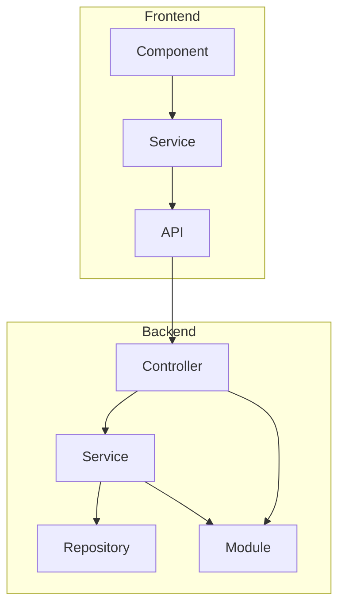

# Tennyson Love Portfolio Site Implementation Plan

## 🌍 Overall Vision

A modern, sleek portfolio site showcasing full-stack software engineering capabilities across UI, backend architecture, API design, DevOps, and AI-assisted tooling. The site will feature interactive demos using Docker containers, a dynamic terminal UI for DevOps simulations, and a clean, white-dominant futuristic design aesthetic. Hosted on Vercel for optimal speed and scalability.

## 🔧 Architecture Overview

- **Frontend:** Angular (TypeScript) + Vite + Material UI
- **Backend:** Python + Prisma + Docker
- **Deployment:** Vercel (Frontend CI/CD) + Docker-based container execution for demos

## 📋 Project Breakdown

### 1. Landing Page

- **Summary:** Short bio matching resume tone.
- **Tech Stack Logos:** TypeScript, Python, NestJS, React, Docker, Prisma, AWS, etc.
- **Design:** White-dominant with subtle accent color (light blue or neon green for futuristic vibe).
- **CTA:** "View My Work" button scrolls to Projects.

### 2. Projects Page (Core Feature)

- **Each Project Includes:**
  - Title, Description, Tech Stack Icons
  - GIF/Screenshot of UI
  - Live Demo Link (or Docker Spin-up)
  - GitHub Link
  - Bullet points showing measurable impact and problem-solving
- **Featured Projects:**
  - **University Connect:** Calendar OAuth, Stripe Connect, NgRx (Store + Facade), rebuild insights. Demo will allow users to upload a resource.
  - **corp:** Real-time messaging UI, webhook routing (Slack/Discord), Dockerized deployment. Demo will be a UI-only click-around experience.
  - **Project California:** MVP execution from design to interactive UI. Demo will feature a Docker terminal where users can type `docker-compose up` to spin up actual containers and see them displayed on the site.
- **Playground Section:** Test data generator scripts, shell tooling, AI-powered utilities.

### 3. Interactive Demos

- **University Connect Demo:** Interactive flow for uploading a new resource (e.g., image, description, tags, location, availability, price).
- **corp Demo:** Clickable UI simulating the text messaging interface. No backend functionality, frontend interaction only.
- **Project California Docker Terminal:** Users can type `docker-compose up` in a mock terminal. This will trigger the spin-up of actual Docker containers for Project California, and the output/running containers will be displayed on the site. (This is specific to Project California).
- General Mini Resource Rental Flow (mock reservation + booking) - _Consider if this is still needed or covered by University Connect._
- Host demos in isolated Docker containers, optionally spinning up via a backend flag/triggered action (primarily for Project California).

### 4. Auth Simulation

- Fake sign-in/sign-up with role toggle: Admin vs User.
- Use mocked Auth0 or Cognito config for conditional rendering.
- Demonstrates secure route handling & role-based access.

### 5. About Me Page

- **Timeline:** From Solar Installer to Full-Stack Dev.
- **Key milestones:** Coding bootcamp, self-taught path, use of AI tools (ChatGPT, Cursor, Devin).
- Embedded quote or philosophy line about learning/growth.

### 6. Resume + Contact

- PDF Resume download (hosted on same repo).
- Contact form (Formspree or NestJS backend).
- External links: GitHub, LinkedIn, Email copy button.

## 🚀 Implementation Steps

### Phase 1: Foundation

- Scaffold Angular project with Vite and Material UI.
- Create routing for: `/`, `/projects`, `/about`, `/contact`.
- Define global styles (white background, spacing, futuristic font).
- Add layout shell and navigation bar.

### Phase 2: Projects Page & Data Model

- Create project schema (title, tech stack, links, demo type).
- Populate static JSON or API for project data.
- Build project card components + filters (by tech or role).

### Phase 3: Interactive Features

- Implement Docker playground terminal UI (fake terminal + type simulation).
- Build fake OAuth Auth UI (Admin/User).
- Add interactive demo for resource booking and messaging.

### Phase 4: Backend (Optional NestJS/Python Docker APIs)

- Build microservices for calendar mock, reservation mock, webhook simulation.
- Containerize each service + document Docker Compose.
- Connect frontend API calls with demo backend services.

### Phase 5: Polish & Deploy

- Optimize for mobile.
- Add metadata, favicon, SEO.
- Deploy to Vercel + test load performance.
- Set up CI/CD, test form submission, validate links.

## 🌌 Aesthetic Direction

- **Primary Color:** White
- **Accent Colors:** Soft neon blue or neon pink
- **Fonts:** Sleek sans-serif (e.g., Inter, Montserrat)
- **Animations:** Subtle fade-ins, hover glows, terminal typing effect
- **Layout:** Grid-based, lots of white space, clean containers
